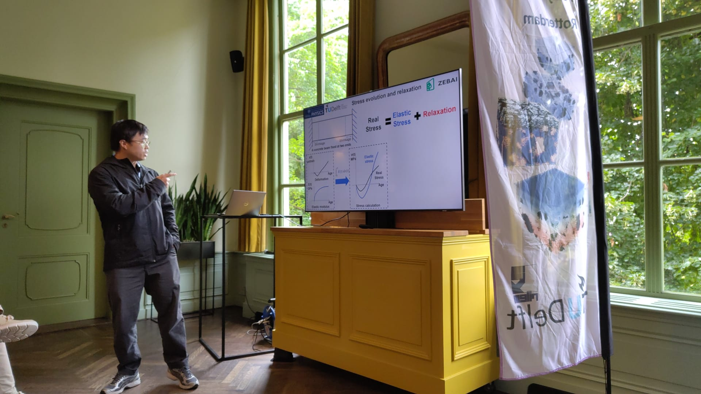
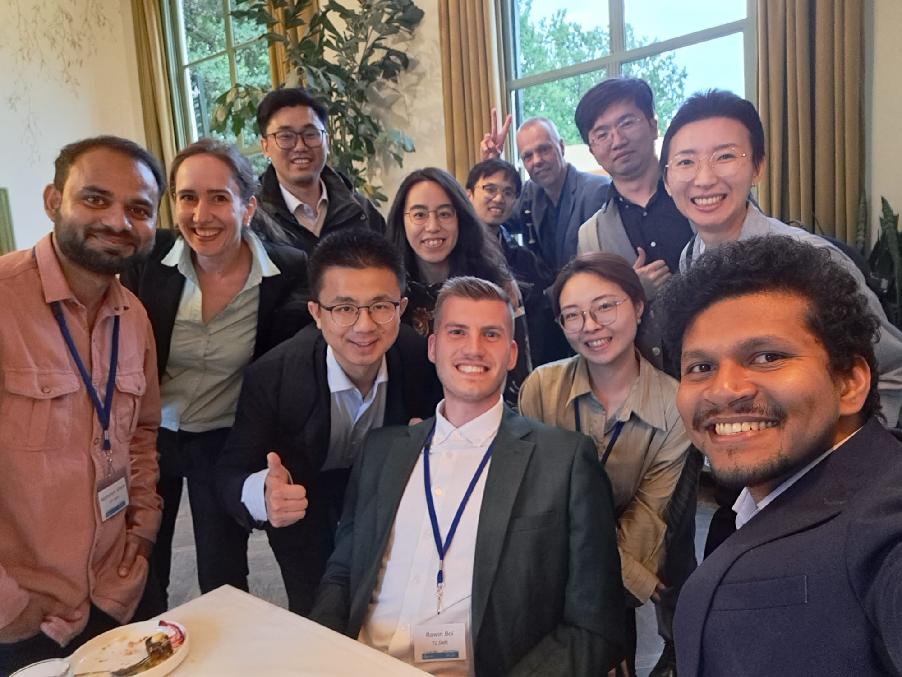

Early in July, I had the pleasure of traveling to the Netherlands to attend the SSCS 2025 conference. It was wonderful to reconnect with my PhD supervisors, Erik and Branko, as well as many old friends and brilliant researchers from around the world.

I also had the opportunity to present my recent work on integrating experimental methods, numerical simulations, and AI techniques to predict stress evolution in concrete materials.

It was an inspiring and enriching experience!  

Many thanks to Prof. Sonia Contera and the EU ZEBAI project for supporting my participation.

<figure style="text-align: center;">
  
  <figcaption><em>Presenting at SSCS 2025</em></figcaption>
</figure>

<figure style="text-align: center;">
  
  <figcaption><em>Catching up with friends</em></figcaption>
</figure>
---
