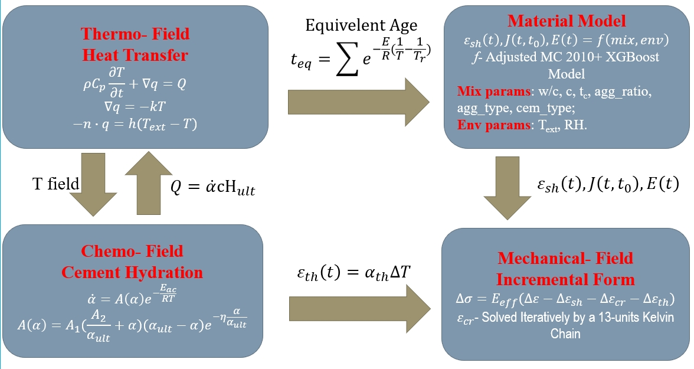

# Thesis Details

Thesis on _Stress evolution in early-age concrete considering autogenous deformation and creep: New experimental and modelling techniques_. Supervised by [Prof Erik Schlangen](https://www.erikschlangen.net/) and [Prof Branko Šavija](https://www.tudelft.nl/en/staff/b.savija/).

The Thermo-Chemo-Mechanical Model for early-age stress evolution:

Some nice results:

