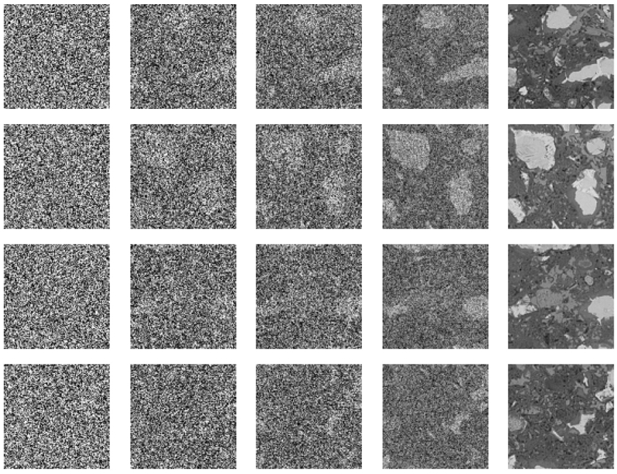
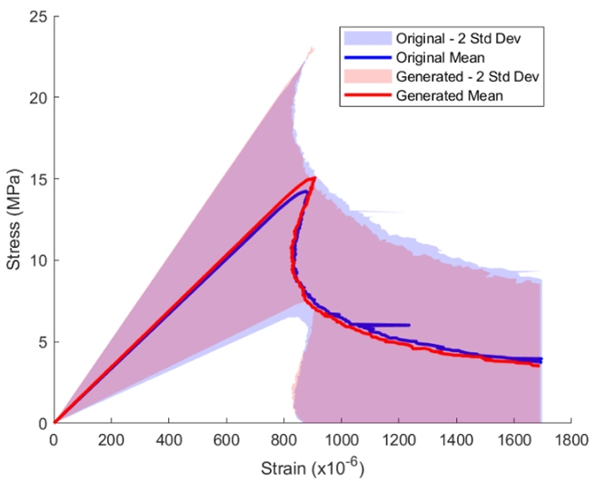

The denoising process of generating a cement microstructure from Gaussian noise:

The stress-strain curves of generated and original microstructures obtained from Lattice Fracture Models:

# Full paper access. 
The full paper can be found [here](https://www.sciencedirect.com/science/article/pii/S2666165925000249).
